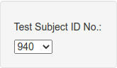
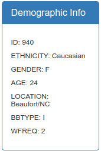
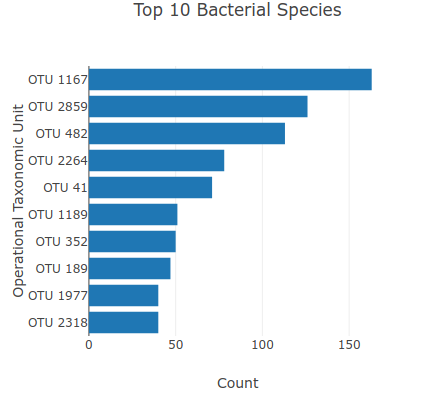
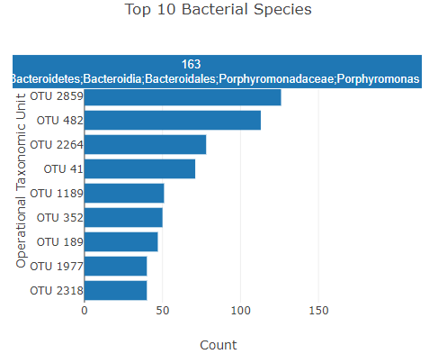
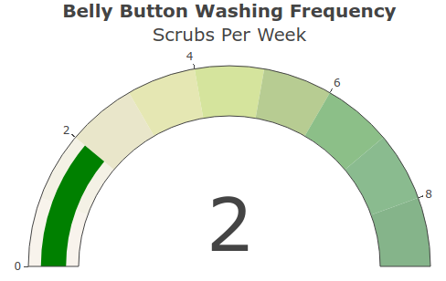

# Belly Button Biodiversity Dashboard

## Purpose

The purpose of this project is to create an interactive dashboard that would display the belly button bacteria information of the subject that is selected from the <code>Test Subject ID No.</code> drop-down, both textually and graphically. The text portion involved the creation of static <code>Demographic Info</code> table which contains summary statistics, like age, gender, and others. The graphical portion comprises three charts: a bar chart, a bubble chart, and a guage chart. 

## Operation

The dashboard operates as follows:

1. When the dashboard is first loaded, the display is created using the first item from <code>Test Subject ID No.</code> drop-down. The <code>Demographic Info</code> table and the three charts are created using the data pertaining to this subject.

2. When the user selects a different user from the <code>Test Subject ID No.</code> drop-down, the <code>Demographic Info</code> table and the charts are updated to display the data for the newly selected subject.

## Dashboard 

####  Test Subject ID No.

The first element of the dashboard is the <code>Test Subject ID No.</code> drop-down which allows the user to view the information pertaining to that particular subject.

</img>

#### Demographic Info 

The second element is the <code>Demographic Info</code> table. It displays basic statistical information about the current subject.

</img>

#### Top 10 Bacterial Species

The third element is the <code>Top 10 Bacterial Species</code> chart. This is a horizontal bar chart which shows the OTU numbers, the count for each OTU number. 

</img>

If the mouse hovers over a bar, the count as well as the bacterial compostion of the OTU are displayed in a pop up.

</img>

#### Operational Taxonomic Unit Distribution

The fourth element is the <code>Operational Taxonomic Unit Distribution</code> bubble chart. While the second element displays the information for the top 10 bacterial species. The bubble chart displays all of the bacterial species information. The graph has the OTU numbers on the x-axis and the counts on the y-axis. Additionally, the sizes of the bubbles correspond to the count for the given OTU. 

</img>

If the mouse hovers over a bubble, the count as well as the bacterial composition of the OTU are displayed in a pop up.

</img>

#### Belly Button Washing Frequency

The fifth and final element is the gauge chart. This chart displays the belly button washing frequency, the number of times the belly button is washed per week. 
It displays the information in two formats: numerically, showing the number of washings per week, and graphically, on a gauge, as is shown below.

</img>

#### Live Demo Link

https://selkhayri.github.io/plotly-deployment/